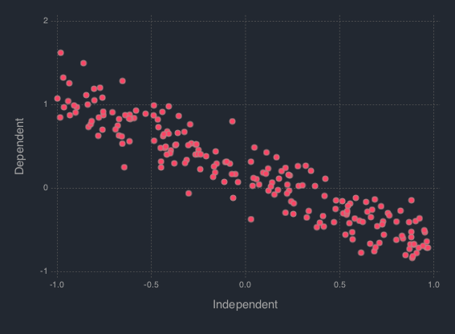

.. _section-tutorial:

Tutorial
=============
Bayesian Linear Regression
--------------------------
In order to illustrate the modeling, the data is simulated from a simple linear regression expectation function. That is the model is given by

.. code-block:: txt

    y_i = w_0 + w_1 x_i + e_i,   e_i ~ N(0, 1 / a)

Data Simulation
~~~~~~~~~~~~~~~~~~~~~
To do so, let :code:`B = [w_0, w_1]' = [.2, -.9]', a = 1 / 5`. Generate 200 hypothetical data:

.. code-block:: julia

    using DataFrames
    using Distributions
    using Gadfly
    using StochMCMC
    Gadfly.push_theme(:dark)

    srand(123);

    # Define data parameters
    w0 = -.3; w1 = -.5; stdev = 5.; a =  1 / stdev

    # Generate Hypothetical Data
    n = 200;
    x = rand(Uniform(-1, 1), n);
    A = [ones(length(x)) x];
    B = [w0; w1];
    f = A * B;
    y = f + rand(Normal(0, a), n);

    my_df = DataFrame(Independent = round(x, 4), Dependent = round(y, 4));

To view the head of the data, run the following:

.. code-block:: julia

    head(my_df)
    # 6×2 DataFrames.DataFrame
    # │ Row │ Independent │ Dependent │
    # ├─────┼─────────────┼───────────┤
    # │ 1   │  0.5369     │ -0.6016   │
    # │ 2   │  0.8810     │ -0.6712   │
    # │ 3   │  0.3479     │ -0.1531   │
    # │ 4   │ -0.2091     │ -0.2004   │
    # │ 5   │ -0.3735     │ -0.1345   │
    # │ 6   │  0.3251     │ -0.7208   │

Next is to plot this data which can be done as follows:

.. code-block:: julia

    plot(my_df, x = :Independent, y = :Dependent)

Setup Probabilities
~~~~~~~~~~~~~~~~~~~~~
In order to proceed with the Bayesian inference, the parameters of the model is considered to be random modeled by a standard Gaussian distribution. That is, :code:`B ~ N(0, I)`, where :code:`0` is the zero vector. The likelihood of the data is given by,

.. code-block:: julia

    L(w|[x, y], b) = ∏_{i=1}^n N([x_i, y_i]|w, b)

Thus the posterior is given by,

.. code-block:: julia
    P(w|[x, y]) ∝ P(w)L(w|[x, y], b)

To start programming, define the probabilities

.. code-block:: julia

    """
    The log prior function is given by the following codes:
    """
    function logprior(theta::Array{Float64}; mu::Array{Float64} = zero_vec, s::Array{Float64} = eye_mat)
      w0_prior = log(pdf(Normal(mu[1, 1], s[1, 1]), theta[1]))
      w1_prior = log(pdf(Normal(mu[2, 1], s[2, 2]), theta[2]))
       w_prior = [w0_prior w1_prior]

      return w_prior |> sum
    end

    """
    The log likelihood function is given by the following codes:
    """
    function loglike(theta::Array{Float64}; alpha::Float64 = a, x::Array{Float64} = x, y::Array{Float64} = y)
      yhat = theta[1] + theta[2] * x

      likhood = Float64[]
      for i in 1:length(yhat)
        push!(likhood, log(pdf(Normal(yhat[i], alpha), y[i])))
      end

      return likhood |> sum
    end

    """
    The log posterior function is given by the following codes:
    """
    function logpost(theta::Array{Float64})
      loglike(theta, alpha = a, x = x, y = y) + logprior(theta, mu = zero_vec, s = eye_mat)
    end

Metropolis-Hasting
~~~~~~~~~~~~~~~~~~~~~~~
To start the estimation, define the necessary parameters for the Metropolis-Hasting algorithm

.. code-block:: julia

    # Hyperparameters
    zero_vec = zeros(2)
    eye_mat = eye(2)

Run the MCMC:

.. code-block:: julia

    srand(123);
    mh_object = MH(logpost; init_est = zeros(2));
    chain1 = mcmc(mh_object, r = 10000);

Extract the estimate

.. code-block:: julia

    burn_in = 100;
    thinning = 10;

    # Expetation of the Posterior
    est1 = mapslices(mean, chain1[(burn_in + 1):thinning:end, :], [1]);
    est1
    # 1×2 Array{Float64,2}:
    #  -0.313208  -0.46376

Hamiltonian Monte Carlo
~~~~~~~~~~~~~~~~~~~~~~~
Setup the necessary paramters including the gradients. The potential energy is the negative logposterior given by :code:`U`, the gradient is :code:`dU`; the kinetic energy is the standard Gaussian function given by :code:`K`, with gradient :code:`dK`. Thus,

.. code-block:: julia

    U(theta::Array{Float64}) = - logpost(theta);
    K(p::Array{Float64}; Σ = eye(length(p))) = (p' * inv(Σ) * p) / 2;
    function dU(theta::Array{Float64}; alpha::Float64 = a, b::Float64 = eye_mat[1, 1])
      [-alpha * sum(y - (theta[1] + theta[2] * x));
       -alpha * sum((y - (theta[1] + theta[2] * x)) .* x)] + b * theta
    end
    dK(p::AbstractArray{Float64}; Σ::Array{Float64} = eye(length(p))) = inv(Σ) * p;

Run the MCMC:

.. code-block:: julia

    srand(123);
    HMC_object = HMC(U, K, dU, dK, zeros(2), 2);
    chain2 = mcmc(HMC_object, leapfrog_params = Dict([:ɛ => .09, :τ => 20]), r = 10000);

Extract the estimate

.. code-block:: julia

    est2 = mapslices(mean, chain2[(burn_in + 1):thinning:end, :], [1]);
    est2
    # 1×2 Array{Float64,2}:
    #  -0.307151  -0.458954

Stochastic Gradient Hamiltonian Monte Carlo
~~~~~~~~~~~~~~~~~~~~~~
Define the gradient noise and other parameters of the SGHMC:

.. code-block:: julia

    function dU_noise(theta::Array{Float64}; alpha::Float64 = a, b::Float64 = eye_mat[1, 1])
      [-alpha * sum(y - (theta[1] + theta[2] * x));
       -alpha * sum((y - (theta[1] + theta[2] * x)) .* x)] + b * theta + randn(2,1)
    end

Run the MCMC:

.. code-block:: julia

    srand(123);
    SGHMC_object = SGHMC(dU_noise, dK, eye(2), eye(2), eye(2), [0; 0], 2.);
    chain3 = mcmc(SGHMC_object, leapfrog_params = Dict([:ɛ => .09, :τ => 20]), r = 10000);

Extract the estimate:

.. code-block:: julia

    est3 = mapslices(mean, chain3[(burn_in + 1):thinning:end, :], [1]);
    est3
    # 1×2 Array{Float64,2}:
    #  -0.302745  -0.430272

Plot it

.. code-block:: julia

    my_df_sghmc = my_df;
    my_df_sghmc[:Yhat] = mapslices(mean, chain3[(burn_in + 1):thinning:end, :], [1])[1] + mapslices(mean, chain3[(burn_in + 1):thinning:end, :], [1])[2] * my_df[:Independent];

    for i in (burn_in + 1):thinning:10000
        my_df_sghmc[Symbol("Yhat_Sample_" * string(i))] = chain3[i, 1] + chain3[i, 2] * my_df_sghmc[:Independent]
    end

    my_stack_sghmc = DataFrame(X = repeat(Array(my_df_sghmc[:Independent]), outer = length((burn_in + 1):thinning:10000)),
                               Y = repeat(Array(my_df_sghmc[:Dependent]), outer = length((burn_in + 1):thinning:10000)),
                               Var = Array(stack(my_df_sghmc[:, 4:end])[1]),
                               Val = Array(stack(my_df_sghmc[:, 4:end])[2]));
    ch1cor_df = DataFrame(x = collect(0:1:(length(autocor(chain3[(burn_in + 1):thinning:10000, 1])) - 1)),
                          y1 = autocor(chain3[(burn_in + 1):thinning:10000, 1]),
                          y2 = autocor(chain3[(burn_in + 1):thinning:10000, 2]));

    p0 = plot(my_df, x = :Independent, y = :Dependent, Geom.point, style(default_point_size = .05cm), Guide.xlabel("Explanatory"), Guide.ylabel("Response"));
    p1 = plot(DataFrame(chain3), x = :x1, xintercept = [-.3], Geom.vline(color = colorant"white"), Geom.histogram(bincount = 30, density = true), Guide.xlabel("1st Parameter"), Guide.ylabel("Density"));
    p2 = plot(DataFrame(chain3), x = :x2, xintercept = [-.5], Geom.vline(color = colorant"white"), Geom.histogram(bincount = 30, density = true), Guide.xlabel("2nd Parameter"), Guide.ylabel("Density"));
    p3 = plot(DataFrame(chain3), x = collect(1:nrow(DataFrame(chain3))), y = :x1, yintercept = [-.3], Geom.hline(color = colorant"white"), Geom.line, Guide.xlabel("Iterations"), Guide.ylabel("1st Parameter Chain Values"));
    p4 = plot(DataFrame(chain3), x = collect(1:nrow(DataFrame(chain1))), y = :x2, yintercept = [-.5], Geom.hline(color = colorant"white"), Geom.line, Guide.xlabel("Iterations"), Guide.ylabel("2nd Parameter Chain Values"));
    p5 = plot(DataFrame(chain3), x = :x1, y = :x2, Geom.path, Geom.point, Guide.xlabel("1st Parameter Chain Values"), Guide.ylabel("2nd Parameter Chain Values"));
    p6 = plot(layer(my_df_sghmc, x = :Independent, y = :Yhat, Geom.line, style(default_color = colorant"white")),
              layer(my_stack_sghmc, x = :X, y = :Val, group = :Var, Geom.line, style(default_color = colorant"orange")),
              layer(my_df_sghmc, x = :Independent, y = :Dependent, Geom.point, style(default_point_size = .05cm)),
              Guide.xlabel("Explanatory"), Guide.ylabel("Response and Predicted"));
    p7 = plot(ch1cor_df, x = :x, y = :y1, Geom.bar, Guide.xlabel("Lags"), Guide.ylabel("1st Parameter Autocorrelations"), Coord.cartesian(xmin = -1, xmax = 36, ymin = -.05, ymax = 1.05));
    p8 = plot(ch1cor_df, x = :x, y = :y2, Geom.bar,  Guide.xlabel("Lags"), Guide.ylabel("2nd Parameter Autocorrelations"), Coord.cartesian(xmin = -1, xmax = 36, ymin = -.05, ymax = 1.05));

    vstack(hstack(p0, p1, p2), hstack(p3, p4, p5), hstack(p6, p7, p8))

.. image:: figures/plot2.png
    :width: 100%
    :align: center
    :alt: alternate text
